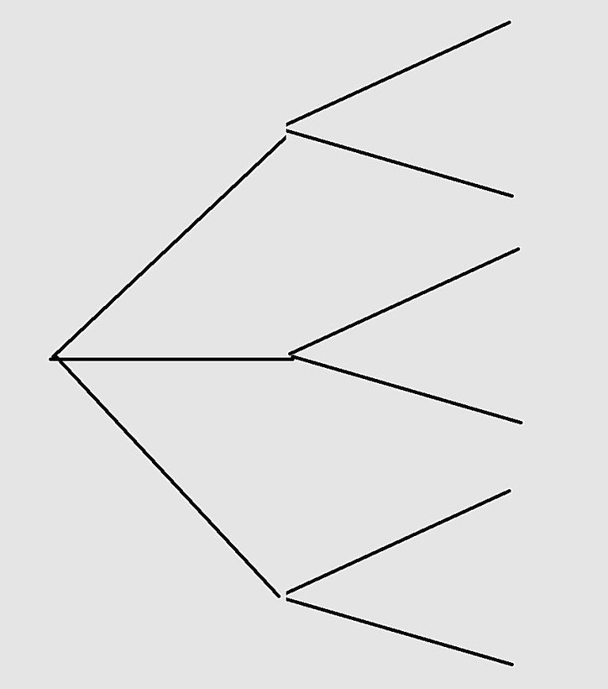
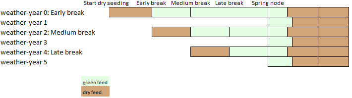

Seasonality
==================

Summary
--------

The steady state version of AFO assumes an average season. The model inputs are determined from the weighted average
of each season. For example, in a simplified environment where there are only three seasons; good, bad and average
each with a 33% chance of occurring and continuous wheat yields of 5, 2 and 3 tonnes/ha respectively. The input to
the steady state model for continuous wheat yield would be 3.33t/ha. There are two main assumption with this method:

    - A good year is as good as a poor year is poor (e.g. the relationship between season quality and profit is linear).
      However, many farmers argue that poor years have a larger negative impact than the positive impact of good seasons.
    - Farmers manage their farm the same irrespective of how the season is unfolding. However, in reality farmers can
      modify their management as the season unfolds (e.g. in the face of a late break, crop area can be reduced).

For analysis where these assumptions are limiting the user can leverage AFOs discrete stochastic programming (DSP)
functionality to represent uncertain parameters. Discrete stochastic programming describes how some management
decisions can be made after a state of nature is observed :cite:p:`NortonHazell1986, Hardaker1991`.
This implies that the farm manager has scope for either avoiding losses or profiting from an unfolding event.
Decision making in farming is highly dependent on how the weather unfolds. Given some information about the start
of a weather-year and probabilities of associated finishes to the year, farmers may alter their management plan.
For example in a season that is unfolding favorably a tactic to maximise farm profit may be to crop additional
area and run a higher stocking rate on the remaining pasture. The sequential nature of farm decision making
means that it can be represented by discrete stochastic programming. However due to the model size restrictions
the continuous nature of decision making must be represented by as few discrete points as possible. Resulting
in a simplified representation of the decision-making process and uncertainty surrounding outcomes.

In the DSP version of AFO the user defines a number of likely season types, their probability, the associated
inputs and the length of the sequence. Note: the number of season types selected and the length of the sequence
is determined as a trade off between model size and detail. Typically farm DSP models have used a one year
sequence :cite:p:`KINGWELL1994, Schäfer2017`. However, AFO provides the option to represent a sequence of season
types. This allows the model to manage a season differently based on the previous season.  AFO optimises the farm
management based on the probabilities of each season sequence and its production. There are two key concepts
that need to be included in the program to ensure reality is represented:

    #. Every sequence is linked such that they all start from a common point (the weighted average of all the
       endpoints). In practical terms what this means is that the farm is in the same state at the beginning of all
       sequences. This means you can't start a good season sequence with more sheep than a poor season sequence.
    #. Management tactics applied in different seasons can not be implemented until the type of season is identified.
       For example, in a season with a poor spring it is not possible to seed less crop than a season with a good
       spring because at the time of seeding the spring conditions are unknown.

At each decision point represented in the model, tactics or adjustments can be made which represent the decision
farmers make. Once a season type has been identified the tactics and adjustments made can be different from the
other seasons.  Discussions with farmers and farm consultants revealed the more important tactical or adjustment
options that farmers considered for various sorts of weather-years. Primarily these tactical options involved
changes in enterprise areas, changes in the rates of fertilisers applied to crops and changes in stocking rates
through some combination of alteration of pasture areas and the sale, agistment or retention of livestock (see
full list of tactics below).

Some tactical options have an impact in the following year. Representation of these options requires accounting
for both their initial year and subsequent year effects. Initial year effects are the changes in inputs, costs
and production that occur in the year of adjustment. Thus replacing one hectare of pasture by a hectare of wheat
would mean accounting for the net change in inputs, costs and production of having both the extra hectare of
wheat and the one less hectare of pasture. Subsequent effects of this adjustment would be the effects on soil
fertility, weed burden and pasture availability in subsequent years and the associated changes to crop and
pasture inputs and outputs.

The DSP method may not be the best option for all projects because it complicates result interpretation,
significantly increases model size and requires more detailed inputs.

Defining the seasons
--------------------

The seasons (weather years) that will be modelled need to be selected based on:

    - Indicators of the season (points in the year when a season can be identified)
    - Tactics that can be implemented
    - Outcome of the season (productivity)

The aim is to select seasons with large production variation that have clear indicators that give the most potential
for implementing tactical management. This will probably be achieved by selecting indicators that maximise the
differentiation of outcome between the season groups. But it also needs to account for the timing of the indicator
and the capacity to make tactical adjustments (eg. no value in finding out it is a good season at harvest).
For example, break of season timing is a clear indicator which can be used to classify season types (e.g. season 1
could be an early break and season 2 could be a late break). The break of season influences production and it is
early enough in the year that farmers can adjust their strategy accordingly.
There can be multiple indicators used to define the season types. For example:

    - Date of season break
    - Summer rainfall level
    - Winter temperature
    - Spring rainfall
    - Crop growth during the previous spring may affect disease build up and carry into the next season which could
      alter crop yields and therefore rotation choice.
    - Rainfall during summer (in the previous season) may affect the soil moisture profile which could affect the
      crop yield outlook for the next season. In the wheatbelt, summer rain may increase the yield prospects
      whereas in the high rainfall areas it may reduce yields due to extra waterlogging.
    - Season forecast might also be used as a season indicator if the forecast is associated with a change
      in probability of the otherwise identified weather-years.

The timing of the weather-years is defined by nodes when they differentiate from their parents. At these nodes more
information becomes available and it is then possible to identify a weather-year from years that have been similar
to that point. This can be visualised as a tree that is branching at each node towards the final amount of detail
for the total number of season types that will be described (Figure 1). This is termed the parent and child at that node.

Figure 1: A visualisation of 6 weather-years that evolve as information becomes available during the year.

The convention used in AFO, in order to minimise model size, is that at each node where new weather-years are
initiated one of the child weather-years retains the parent description (which is either a slice in a parameter
array or an element of a pyomo set) and the other(s) take on a new description. An alternative visualisation
that is more similar to the design in AFO is Figure 2. In the convention of AFO weather-year0 is the parent of
weather-year 2 at the early break, and is the parent of weather-year1 at the spring node.

Figure 2: Alternative visualisation of 6 weather-years with 3 season breaks and 2 different spring outcomes.

The weather-years that might need more thought to represent are:

    - False break. Pasture germinates and then a portion dies prior to receiving follow-up rainfall. This could be
      represented as:

        - the break that turns out to be false is the start of the next weather-year

      Is there data on the proportion of death in a false break based on the defoliation. If there is this could be
      built into the greenha decision variables with different senescence by FOO level, or a fixed senescence in kg/ha
      (so less proportion of death with lower grazing). This relationship would determine the optimum grazing in a false break.
    - Summer rainfall affecting the quality of the dry pasture from the previous growing season and also affecting
      the crop yields in the next growing season (at least in the wheatbelt on the heavier soils that store moisture).

Each season type is allocated a probability based on the historical (or other method) of occurrence. A season type
with 0 probability could be excluded from the model to reduce size.

Season details
--------------

Season start
^^^^^^^^^^^^
The season start is the point when the previous season ends and the new season begins. Choice of season start must be
thought through carefully. From a crop and pasture perspective a changeover in autumn (season break) seems most
sensible because that aligns with a change of crop year and the beginning of the new pasture growth cycle. However,
season start is further complicated by livestock because liveweight needs to be averaged and distributed (such that
lw essentially has a singleton z axis at the beginning and end of each year) at the start of each season. This is
required so that each season starts and finishes in a common position. The live weights also need to be condensed
at prejoining because there are 81 patterns each year which start from 3 common points (this is required to save
space). Difference in production (wool and repo) due to how an animal got to a given live weight (e.g. gain then
lose vs maintain) is lost when averaging/condensing the liveweights. Thus from the perspective of livestock it would
be optimal to match the season start with prejoining which occurs at the beginning of the sheep reproduction cycle
so that minimal reproduction information is lost.

This leaves two reasonable options for season start to occur:

    #. Start as close to the beginning of reproduction cycle as possible. This tracks production more accurately
       particularly if only one TOL is used (because the prejoining will be similar time for all animals)
       but means important aspects of season type may not be represented accurately e.g. season start in december
       means you don't capture the impacts of a poor spring on the following year because at season start the
       seasons are averaged.
    #. Start at the break of season. This means some production variation between livestock in each season is lost
       but the crop and pasture will be much more accurate.

Dry seeding start has been selected as the point all seasons start from. This maximises the accuracy of pasture
supply in different seasons. It also means that dry seeding in the earlier breaks occurs in all the subsequent breaks.

Periods
^^^^^^^
When the seasons are unclustered (identified) the parent season type needs to transfer all the 'starting' info to the
newly created season type. Thus, season nodes need to be added to all period arrays used by model activities (if the
season nodes are not periods then there is not a new activity and thus the model can’t manage the seasons differently).
For the stock this means each season node has to be a DVP so that the animals can be transferred. For the pasture it
means each season node needs to be a feed period to allow the transfer of feed. Furthermore, season start node is
required so that activity levels in each season can start from a common point (weighted average of the end condition).

Tactics
--------

There are many tactical or adjustment options represented in AFO that reflect a farmers reality. The tactics revolve
around land use area adjustment, machinery and labour adjustment, seasonal sheep live weight patterns and sheep
agistment, pasture and stubble management, supplementary feeding and application rates of nitrogenous fertilisers.
The same tactical adjustments are made to all seasons that are clustered (cannot be distinguished) at the time a
decision is made. E.g. tactical adjustments dependent on an early season break are the same for all seasons which
have an early break irrelevant of what happens in spring because at the time of making the break of season decision
the spring conditions are unknown.

Seeding cereals into pasture
^^^^^^^^^^^^^^^^^^^^^^^^^^^^
Cereal crops tend to have better early vigour than pastures thus sowing some cereals into pasture provide some
additional feed early in the growing season.

Spring application of N to pasture
^^^^^^^^^^^^^^^^^^^^^^^^^^^^^^^^^^
For seasons with a slow spring applying nitrogen to pasture can provide some valuable additional FOO.

Rotation
^^^^^^^^
Rotation area can be adjusted depending on the date of season break or other early indicators such as
residual soil moisture from summer rainfall.

Fodder crops
^^^^^^^^^^^^
In adverse seasons where either livestock feed is short or crops are frosted or are not worthy of harvest,
saleable crops can be turned to fodder. I.e. instead of harvesting a crop it is grazed by livestock as a good
source of summer feed.

Bale crops
^^^^^^^^^^^^
Crops that were planted with the expectation of being harvested for grain can be baled as hay.
This may occur in adverse seasons where either livestock feed is short or crops are frosted or are not worthy of harvest.

Winter crop grazing
^^^^^^^^^^^^^^^^^^^^^^^^^^^^
Saleable crops can be grazed early in the growing season with little yield penalties. This can provide
additional feed in seasons with a slow start.

Labour supply
^^^^^^^^^^^^^
Perm and manager labour is fixed (must be the same for each season type) however, casual labour can be
optimised for each season as it unfolds.

Machinery contracting
^^^^^^^^^^^^^^^^^^^^^
If the timeliness of an activity is an issue, contract services can be selected to improve the work rate.
This could be valuable in a late break to ensure the crops get the maximum possible growing season.

Dry seeding
^^^^^^^^^^^
A useful tactic to improve timeliness of seeding to ensure crops get the maximum possible growing season.

Crop inputs
^^^^^^^^^^^
Cropping inputs can be tactically adjusted depending on how the season unfolds. This can not currently be
optimised by AFO however the user can manually adjust the inputs to capture expected seasonal inputs adjustments.

Summer cropping
^^^^^^^^^^^^^^^
Currently this is not hooked up. Rotations do have a node axis which would allow this type of transfer. Just
need to work out a way to do the history transfer.
Summer cropping would need to be a new landuse (so it can have a different harvest date and grain income date).

Agistment
^^^^^^^^^
Agisting livestock can be a useful tactic if farm management/circumstances are different. For example,
it may be profitable to agist livestock to a farm that is 100% cropping as there is lots of stubble available during summer.

Confinement feeding
^^^^^^^^^^^^^^^^^^^
Confinement feeding can be a good tactic to allow pasture deferment at the beginning of the season or
to keep ground cover on paddocks in the late summer and autumn.

Supplement feeding
^^^^^^^^^^^^^^^^^^^^^^^^^^^^
In paddock supplement feeding can be used as a tactic to help finish lambs for sale, ensure dams reach
target conditions for reproduction or help meet energy requirements during seasons with poor pasture growth.

Changing liveweight
^^^^^^^^^^^^^^^^^^^
Altering livestock weight can be used as a tactic to handle varying feed availability due to seasonal variation.

Early weaning
^^^^^^^^^^^^^
There are multiple weaning times in the generator for the offspring and the young at foot, however only one
weaning time for the dams. This is handled by a proportion of the yatf having to be weaned at the standard
time to be replacements. Otherwise the replacements would likely be selected from the earliest weaning and
there would be a period from the early weaning to the standard weaning in which the weaners would not be being fed.

If early weaning of all progeny is required in the seasonality version of the model then the standard weaning
time for those season types would need to be altered so that replacements are drawn from the early weaning time.
Or weaning age (a0) would need to be included in the dam axes.

Not mating dams
^^^^^^^^^^^^^^^
Including an unmated cluster for the dams in each year will allow the tactic of not mating the dams. If a
seasonal outlook (of sufficient accuracy) can be made prior to joining then there is the option of not mating
ewes in a poor season. This is probably more related to the conditions in eastern Australia where a failed
spring is a more common occurrence and a reasonable forecast of spring rainfall may be available at joining
(if it is a late joining flock - March or April).

Selling scanned dry dams or other dams at scanning
^^^^^^^^^^^^^^^^^^^^^^^^^^^^^^^^^^^^^^^^^^^^^^^^^^
Currently the sale at scanning only includes selling the scanned dry dams. This could be expanded to
other scanning parities by altering the definition of the animals that can be in the t axis for sold at
scanning. Note; this might also have implications with the k2 cluster, which is clustering the e1b1 axes
into decision variables.

Retain dry ewes
^^^^^^^^^^^^^^^
Often the strategy is to sell dry ewes however if the season is favorable a tactical adjustment could be
to retain the drys to get a wool cut and attempt to mate them the following year.

Selling at other times
^^^^^^^^^^^^^^^^^^^^^^
Dams and offspring sale time and market can be adjusted depending on the season. For example the target
market for offspring might be the abattoir however, in a poor season they could be turned off into the
store market. Note extra sale times can be added by expanding the t axis or by adding sale options such
that sale can occur in each DVP (only one sale can exist per dvp per t slice). For example, dams could
currently have 2 sale options in each DVP (because there are 2 slices in the t axis). Therefore other
tactical selling options could be added without expanding the size of the t axis in the post processing.

Price Variation
---------------

.. toctree::
   :maxdepth: 1

   PriceVariation
